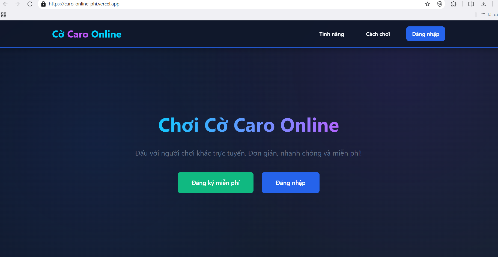
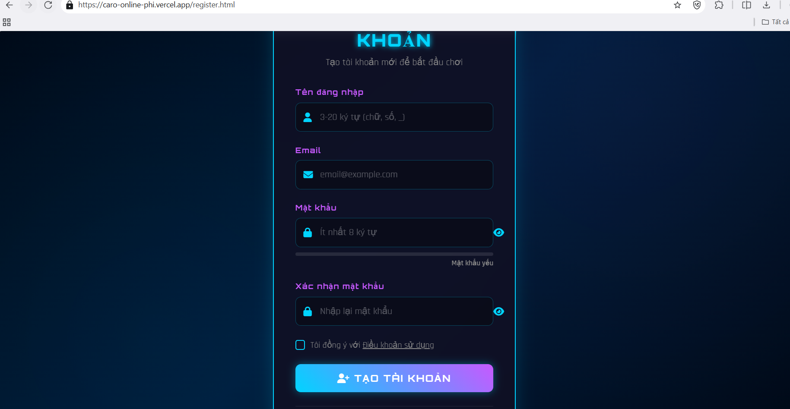
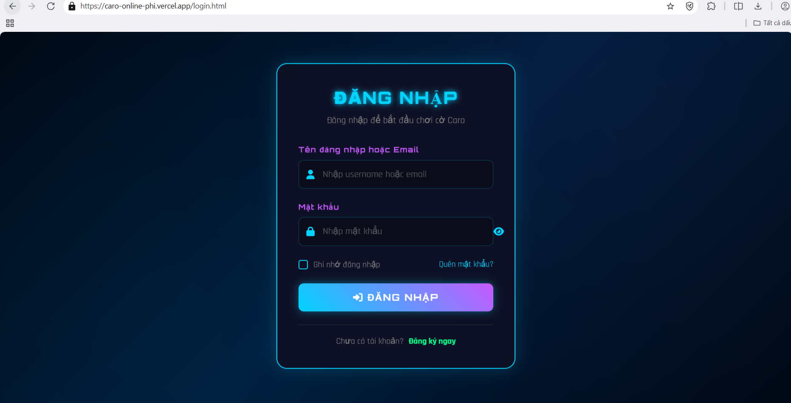
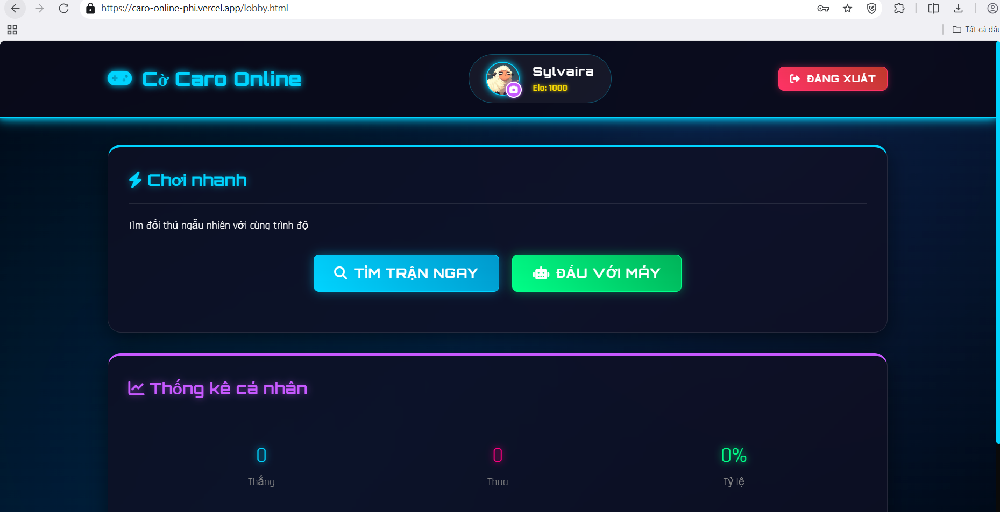
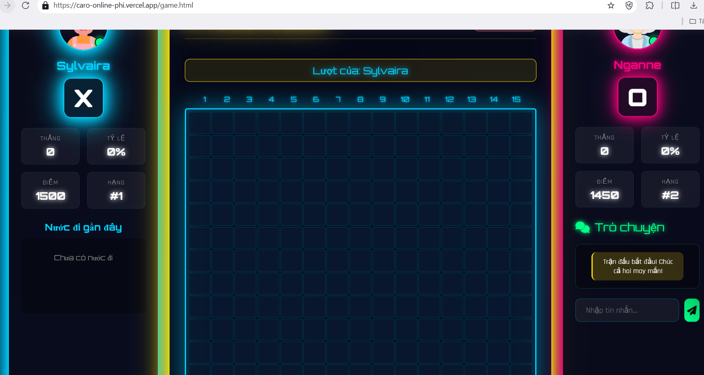
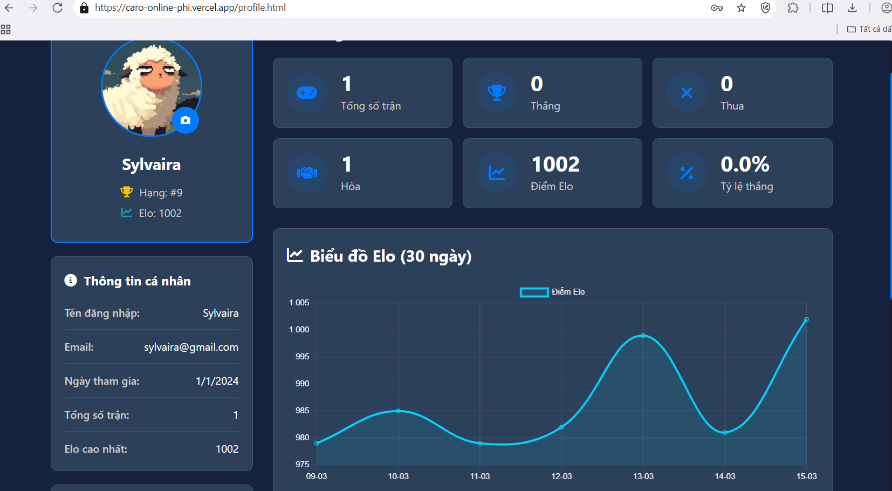

# Caro Online

Ứng dụng chơi cờ Caro trực tuyến với đầy đủ tính năng, được xây dựng theo mô hình Client-Server, mang lại trải nghiệm chơi mượt mà và thời gian thực.

##  Tính năng chính

- **Ghép trận tự động**: Hệ thống tự động tìm kiếm và kết nối các người chơi với nhau.
- **Chơi Real-time**: Sử dụng WebSocket để truyền tải nước đi ngay lập tức.
- **Hệ thống Chat**: Trò chuyện trực tiếp với đối thủ trong trận đấu.
- **Quản lý hồ sơ**: Đăng ký, đăng nhập và tùy chỉnh thông tin cá nhân.
- **Lịch sử đấu**: Xem lại danh sách các trận đấu đã tham gia.
- **Giao diện thân thiện**: Thiết kế đơn giản, dễ sử dụng trên trình duyệt.

##  Giao diện ứng dụng

  
<b>Trang chủ</b>

  
    
  
<b>Đăng ký & Đăng nhập</b>

  
   
  
    
  
<b>Phòng chờ</b>

  
    
  
<b>Trận đấu</b>

  
    
  
<b>Hồ sơ cá nhân</b>

  

## 🛠 Công nghệ sử dụng

### Frontend
- **HTML5 & CSS3**: Xây dựng cấu trúc và giao diện ứng dụng.
- **JavaScript (ES6)**: Xử lý logic phía client và tương tác người dùng.
- **WebSocket**: Kết nối thời gian thực với server.
- **Font Awesome**: Hệ thống icon phong phú.

### Backend
- **Java**: Ngôn ngữ lập trình chính xử lý logic server.
- **Java-WebSocket**: Thư viện hỗ trợ kết nối WebSocket phía server.
- **MySQL**: Hệ quản trị cơ sở dữ liệu lưu trữ thông tin người dùng và trận đấu.
- **JDBC**: Kết nối và thực thi các câu lệnh SQL với MySQL.
- **ngrok**: Hỗ trợ public server local ra internet.

---
*Phát triển bởi [Trần Như Liễu]*

